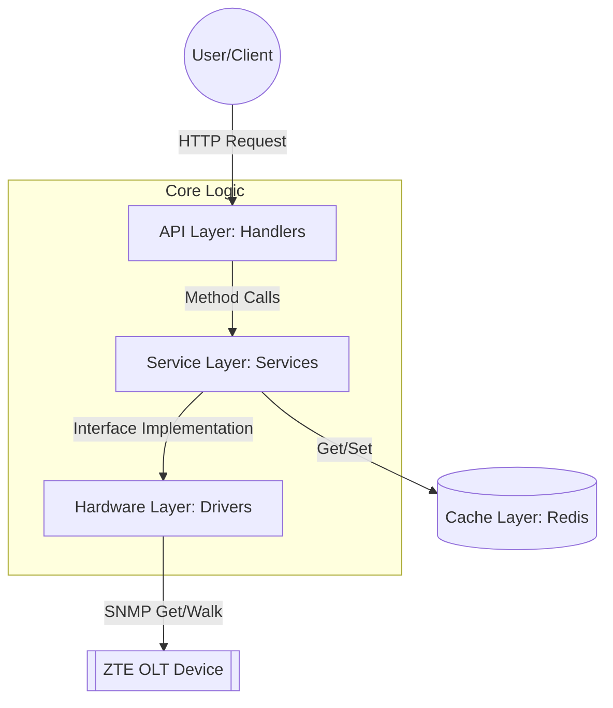
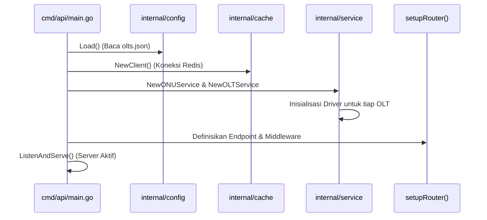
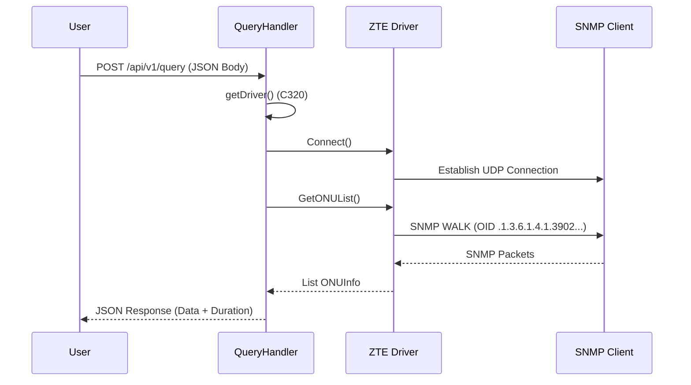
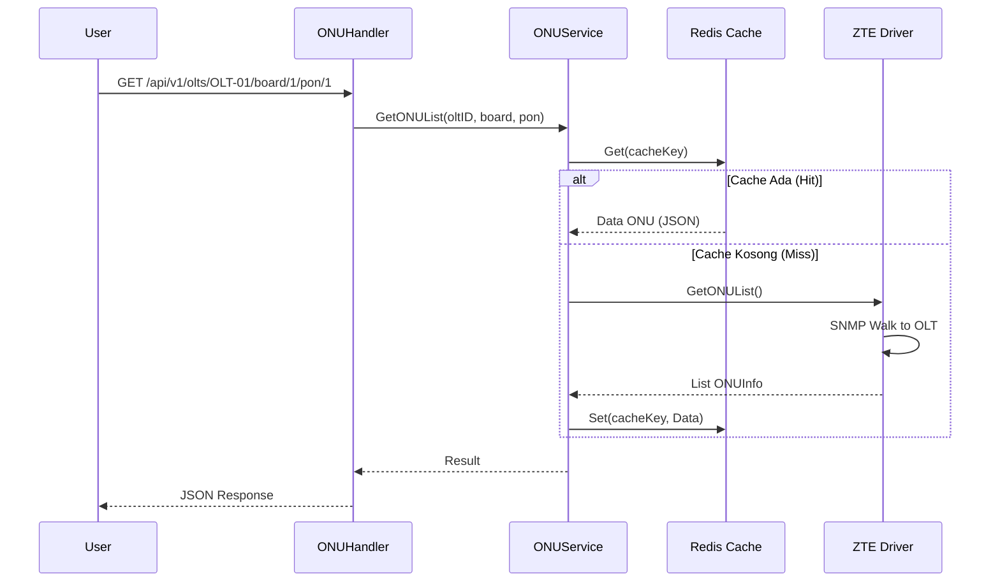

# Diagram Alur SNMP-ZTE

File ini berisi kumpulan diagram Mermaid yang menjelaskan alur kerja sistem SNMP-ZTE. Anda dapat melihat diagram ini menggunakan preview Markdown yang mendukung Mermaid, atau menyalin kodenya ke [Mermaid Live Editor](https://mermaid.live/).

## 1. Arsitektur Global

## 2. Alur Startup Aplikasi

## 3. Alur Request: Query Stateless (/api/v1/query)

## 4. Alur Request: Query Berbasis ID (/api/v1/olts/{id}/...)

